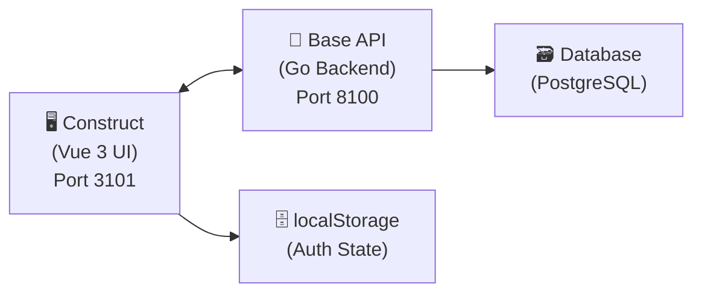

# 🏗️ Introduction to Construct

**Construct** is the beautiful frontend for the **Base Go framework**. While Base provides the powerful backend foundation with modules, authentication, and APIs, Construct adds the modern Vue interface with beautiful components and exceptional developer experience.

---

## 🎯 What is Construct?

Construct is a **Vue 3 + Vite framework** that brings Nuxt-like developer experience to non-Nuxt projects:

### ✨ **Core Features**
- 🔄 **Wraps Base APIs** with type-safe TypeScript interfaces
- 🎨 **Modern UI** with Nuxt UI 4 components and Tailwind CSS 4
- ⚡ **Fast Development** with auto-routing, hot reload, and centralized auto-imports
- 📝 **Convention over Configuration** for consistent, maintainable code

---

## 🏛️ Architecture



### **Separation of Concerns**
- **📡 Base (Go)**: Authentication, database, business logic, API endpoints
- **🖥️ Construct (Vue)**: User interface, routing, frontend state management
- **🔐 Auth Flow**: localStorage-based session persistence with Base API integration

---

## 🚀 Key Features

### ⚡ **Lightning Fast Development**
```typescript
// File-based routing - just create the file!
// app/pages/users/[id].vue → /users/:id

// Auto-imports - no import statements needed!
const auth = useAuthStore()        // Pinia store
const user = ref<User>()          // Types
const { navigateTo } = useNavigation()  // Composables
```

### 🎨 **Beautiful UI Out of the Box**
- **Nuxt UI 4** components with excellent defaults
- **Tailwind CSS 4** for modern styling
- **Dark/Light mode** support built-in
- **Responsive design** patterns included

### 🔒 **End-to-End Type Safety**
```typescript
// Types automatically sync with Go models
interface User {
  id: number
  first_name: string
  email: string
  role: { id: number; name: string }
}

// API responses are fully typed
const response = await apiClient.login(credentials) // → LoginResponse
```

### 🛡️ **Simple, Secure Middleware**
```typescript
// Protect routes with simple middleware
layout({ use: "default", middleware: ["auth"] })     // Requires login
layout({ use: "admin", middleware: ["admin"] })      // Requires admin role
layout({ use: "default" })                          // Public access
```

---

## ⚡ Quick Start

### **1. Prerequisites**
```bash
# Ensure you have these installed
node --version   # v18+
npm --version    # v9+
go version       # v1.21+
```

### **2. Start Development**
```bash
# Clone and setup (if not already done)
git clone <your-repo>
cd project-name

# Install dependencies
npm install

# Start both servers
./run.sh

# 🎉 Ready!
# API: http://localhost:8100
# UI:  http://localhost:3101
```

### **3. Your First Page**
```vue
<!-- app/pages/hello.vue -->
<template>
  <div>
    <h1>Hello {{ user?.first_name || 'World' }}!</h1>
    <UButton @click="handleClick">Click me</UButton>
  </div>
</template>

<script setup lang="ts">
// No imports needed! Everything is auto-imported
layout({ use: "default" }) // Public page

const auth = useAuthStore()
const user = computed(() => auth.user)

const handleClick = () => {
  navigateTo('/dashboard')
}
</script>
```

---

## 📁 Project Structure

```
📦 ui/
├── 🎯 app/                 # Your application code
│   ├── 📄 pages/          # Auto-routed pages (like Nuxt)
│   ├── 🎨 layouts/        # Layout components
│   ├── 🧩 components/     # App-specific components
│   └── 🔧 composables/    # App-specific logic
├── ⚙️ core/               # Framework code (reusable)
│   ├── 🧩 components/     # Core UI components
│   ├── 🔧 composables/    # Framework composables
│   ├── 🛡️ middleware/     # Route protection
│   ├── 📦 stores/         # Pinia stores
│   ├── 📝 types/          # TypeScript definitions
│   └── 🛠️ utils/          # Utility functions
├── 📚 docs/               # Documentation (this!)
└── 🔧 .construct/         # Generated files (like .nuxt)
    ├── 🛣️ pages.ts        # Auto-generated routes
    └── 📝 types/          # Auto-generated type definitions
```

### **🎯 App vs Core**
- **`app/`**: Your project-specific code
- **`core/`**: Reusable framework code
- **Benefit**: Framework updates don't break your app code

---

## 🔄 Development Workflow

### **1. Create a Page**
```bash
# Create file
touch app/pages/products.vue

# Route automatically available at /products
# No configuration needed!
```

### **2. Add Authentication**
```vue
<script setup lang="ts">
// Protect the route
layout({ use: "default", middleware: ["auth"] })

// Use auth state
const auth = useAuthStore()
const { user, logout } = auth
</script>
```

### **3. Make API Calls**
```vue
<script setup lang="ts">
const products = ref<Product[]>([])

// API client is auto-imported and configured
const loadProducts = async () => {
  try {
    const response = await apiClient.get('/api/products')
    products.value = response.data
  } catch (error) {
    console.error('Failed to load products:', error)
  }
}

onMounted(loadProducts)
</script>
```

---

## 🎉 Why Choose Construct?

### **🏗️ Built for Base**
- **Perfect Integration**: Designed specifically for Base Go framework
- **Type Sync**: TypeScript types automatically match Go models
- **Auth Ready**: Built-in authentication flow with Base API

### **🚀 Developer Experience**
- **Nuxt-like DX**: File-based routing, auto-imports, conventions
- **No Configuration**: Sensible defaults, works out of the box
- **Hot Reload**: Instant feedback during development

### **📈 Production Ready**
- **Performance**: Vite build optimization, tree-shaking
- **Security**: Middleware protection, token management
- **Scalable**: Clean architecture, separation of concerns

---

## 🛣️ Next Steps

1. **📖 [Quick Start Guide](./quick-start.md)** - Build your first page
2. **🔐 [Authentication Example](../examples/authentication.md)** - Implement login/logout
3. **🛡️ [Middleware Guide](../middleware/overview.md)** - Protect your routes
4. **🔄 [Auto-Imports](../configuration/auto-imports.md)** - Understand the import system

**Ready to build something amazing? Let's go! 🚀**